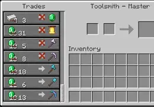

<p align="center">
  
</p>

# Villager Trades Backport

[](https://minecraft.net/)
[](https://files.minecraftforge.net/)

**Villager Trades Backport** — модификация для Minecraft 1.7.10 на базе сборочного стека GTNH (RetroFuturaGradle / UniMixins), полностью переносящая современную систему торговли деревенских жителей (Minecraft 1.14+ Village & Pillage и Villager Trade Rebalance) в версию 1.7.10 на основе открытого мода с оптимизацией и глубокой интеграцией в экосистему GTNH.

**Авторы:** `MarryBye` + `Gemini AI`

---

## 🎯 Основные механики и возможности

- 📜 **Уровни мастерства и прогресс опыта (Villager Levels & XP):**
  - Пять уровней профессионализма жителей: **Новичок (Novice)**, **Ученик (Apprentice)**, **Подмастерье (Journeyman)**, **Эксперт (Expert)** и **Мастер (Master)**.
  - Наглядная шкала опыта в интерфейсе торговли, отображающая прогресс до следующего уровня.
  - Каждая совершенная сделка начисляет опыт жителю, а при достижении нового уровня открываются новые, более ценные и разнообразные торговые предложения.
  - Визуальные значки уровня (камень, железо, золото, изумруд, алмаз) на одежде и в интерфейсе жителя.

- 🔄 **Пополнение запасов и лимиты сделок (Restocking & Demand):**
  - Сделки больше не блокируются навсегда: при исчерпании запаса житель может пополнять запасы товаров (restock) до 2 раз в день при доступе к рабочему месту.
  - Динамическое ценообразование: активная скупка определенного товара временно увеличивает его цену из-за высокого спроса, а со временем цена возвращается к базовой.
  - Скидки за репутацию: скидки за высокий уровень популярности в деревне, спасение и исцеление жителей-зомби, а также эффект «Герой деревни».

- 🖥️ **Современный торговый интерфейс (Modern Trading GUI 1.14+):**
  - Полноценная двухпанельная панель обмена: вертикальный список всех доступных и открытых предложений слева со скроллингом и быстрый обмен в один клик.
  - Отображение точных затрат с учетом скидок (зачеркнутая базовая цена и актуальная сниженная).
  - Плавная прокрутка списка сделок колесом мыши с аппаратной поддержкой [lwjgl3ify](https://github.com/GTNewHorizons/lwjgl3ify).

- 🗺️ **Биомные профессии и ребаланс торгов (Biome Trades & Trade Rebalance):**
  - Поддержка биомных вариаций жителей (пустыня, джунгли, саванна, равнины, тайга, болото, снежные биомы).
  - Опциональная механика Villager Trade Rebalance с разделением зачарованных книг по биомам для библиотекарей и сбалансированными таблицами обмена.

- 🛠️ **Рабочие места и профессии (Workstations & Job Sites):**
  - Интеграция с рабочими блоками профессий.
  - Возможность смены профессии у незакрепленных жителей без совершенных сделок.

---

## 🧩 Внешние зависимости и совместимость (Compatibility)

Мод спроектирован с учетом обязательной работы с ключевыми компонентами платформы [GTNewHorizons](https://github.com/GTNewHorizons), а также бесшовной интеграции с популярными модами экосистемы:

| Мод | Репозиторий GTNH | Статус | Назначение и интеграция |
| :--- | :--- | :--- | :--- |
| [**UniMixins**](https://github.com/GTNewHorizons/UniMixins) | [`GTNewHorizons/UniMixins`](https://github.com/GTNewHorizons/UniMixins) | **Обязателен** | Базовая система миксинов (Mixin 0.8.7) для внедрения логики торговли в классы `EntityVillager`, `MerchantRecipeList` и интерфейсы Forge. |
| [**GTNHLib**](https://github.com/GTNewHorizons/GTNHLib) | [`GTNewHorizons/GTNHLib`](https://github.com/GTNewHorizons/GTNHLib) | **Обязателен** | Фундаментальная библиотека утилит, сериализации, работы с событиями и оптимизаций платформы GTNH. |
| [**lwjgl3ify**](https://github.com/GTNewHorizons/lwjgl3ify) | [`GTNewHorizons/lwjgl3ify`](https://github.com/GTNewHorizons/lwjgl3ify) | **Обязателен** | Современный бэкенд LWJGL 3: сырой ввод мыши, плавный скроллинг списка сделок в GUI и корректный рендеринг шрифтов. |
| [**Village Names**](https://github.com/GTNewHorizons/VillageNames) | [`GTNewHorizons/VillageNames`](https://github.com/GTNewHorizons/VillageNames) | **Обязателен** | Глубокая синергия: совместимость с генерацией деревень, именами жителей, кастомными профессиями и биомными костюмами VillageNames. |
| [**Angelica**](https://github.com/GTNewHorizons/Angelica) | [`GTNewHorizons/Angelica`](https://github.com/GTNewHorizons/Angelica) | Поддерживается | Графический движок Sodium / Iris для 1.7.10: максимальный FPS, плавный рендеринг интерфейса торговли без графических артефактов. |
| [**Et Futurum Requiem**](https://github.com/GTNewHorizons/Et-Futurum-Requiem) | [`GTNewHorizons/Et-Futurum-Requiem`](https://github.com/GTNewHorizons/Et-Futurum-Requiem) | Поддерживается | Интеграция современных предметов (бочки, точило, фонари, новые зачарования и ресурсы) в таблицы торговли соответствующих профессий. |
| [**Hodgepodge**](https://github.com/GTNewHorizons/Hodgepodge) | [`GTNewHorizons/Hodgepodge`](https://github.com/GTNewHorizons/Hodgepodge) | Поддерживается | Комплекс платформенных фиксов, оптимизаций тиков сущностей и инвентарей. |
| [**Not Enough Items (NEI)**](https://github.com/GTNewHorizons/NotEnoughItems) | [`GTNewHorizons/NotEnoughItems`](https://github.com/GTNewHorizons/NotEnoughItems) | Поддерживается | Полноценная поддержка оверлея NEI в окне торговли жителей, поиск и просмотр рецептов. |
| [**NEI Integration**](https://github.com/GTNewHorizons/NEI-Integration) | [`GTNewHorizons/NEI-Integration`](https://github.com/GTNewHorizons/NEI-Integration) | Поддерживается | Отображение торговых сделок и предложений жителей в каталоге NEI. |
| [**Tinkers' Construct (TiC)**](https://github.com/GTNewHorizons/TinkersConstruct) | [`GTNewHorizons/TinkersConstruct`](https://github.com/GTNewHorizons/TinkersConstruct) | Поддерживается | Совместимость со сделками и профессиями деревенских жителей из Tinkers' Construct. |

---

## 👨‍💻 Руководство для разработчиков (Developer Guide)

### Где брать зависимости для локальной разработки:

Все внешние бинарные dev-зависимости исключены из системы контроля версий (`.gitignore`), чтобы не засорять Git-репозиторий тяжелыми jar-файлами.

Для компиляции и локального тестирования мода вам понадобятся dev-сборки модов. Вы можете взять их:
1. Из официальных релизов репозиториев организации **[GTNewHorizons](https://github.com/GTNewHorizons)** по ссылкам из таблицы выше (скачивайте архивы с постфиксом `-dev.jar`).
2. Либо скомпилировать локально из соответствующих репозиториев командой `./gradlew build`.

**Список файлов в папке `libs/`:**
- `+unimixins-all-1.7.10-<version>-dev.jar` *(обязательно)*
- `gtnhlib-<version>-dev.jar` *(обязательно)*
- `lwjgl3ify-<version>-dev.jar` *(обязательно)*
- `VillageNames-<version>-GTNH-dev.jar` *(обязательно)*
- `angelica-<version>-dev.jar` *(поддерживается)*
- `etfuturum-<version>-GTNH-dev.jar` *(поддерживается)*
- `hodgepodge-<version>-dev.jar` *(поддерживается)*
- `NotEnoughItems-<version>-GTNH-dev.jar` *(поддерживается)*
- `NEIIntegration-<version>-dev.jar` *(поддерживается)*
- `TConstruct-<version>-GTNH-dev.jar` *(поддерживается)*

Поместите эти jar-файлы в директорию `libs/` в корне проекта. Сборочный скрипт `dependencies.gradle` настроен на автоматическое подключение всех `.jar` файлов из этой папки (`compileOnly(fileTree(dir: "libs", include: ["*.jar"]))`).

> [!IMPORTANT]
> **Принцип мягкой совместимости:** Мод гарантирует компиляцию и работу на базовом окружении (Forge + UniMixins + GTNHLib + lwjgl3ify + VillageNames). Интеграции с модами `Angelica`, `Et Futurum Requiem`, `Tinkers' Construct` и `NEI` выполнены мягко (soft-dependencies) и защищены проверками наличия в рантайме.

---

## 🛠️ Сборка и запуск

```bash
# 1. Поместите dev-jar зависимости в папку libs/ (см. раздел для разработчиков выше)
./gradlew setupDecompWorkspace # Подготовка декомпилированного рабочего пространства
./gradlew runClient           # Запуск клиента Minecraft для тестирования
./gradlew build               # Сборка готового jar-файла мода
./gradlew spotlessApply       # Автоматическое форматирование кода в соответствии со стандартами
./gradlew clean               # Очистка директории сборки
```

---

## 🗺️ Планы развития (Roadmap)

- [x] **Современный торговый интерфейс (Modern Trading GUI):**
  - Двухпанельный макет 1.14+ со списком сделок слева, кнопками быстрого выбора и плавной прокруткой через lwjgl3ify.
  - Аутентичные текстуры кнопок, рамок и слотов в ванильном стиле.
- [x] **Система уровней и опыта (Villager Leveling & XP):**
  - 5 рангов (Novice -> Apprentice -> Journeyman -> Expert -> Master) со шкалой прогресса и тултипом в GUI.
  - Мгновенное повышение уровня жителя в реальном времени прямо в открытом окне торговли с разблокировкой сделок, звуками и зелеными частицами.
  - Прогрессирующая сложность рангов и поддержка массовой торговли через Shift-клик с переносом излишка сделок в следующий ранг.
- [ ] **Таблицы торговли и профессии (Vanilla 1.14+ Trade Tables):**
  - Полная переработка пулов сделок для всех ванильных профессий (Оружейник, Бронник, Инструментальщик, Мясник, Картограф, Священник, Фермер, Рыбак, Кожевник, Библиотекарь, Каменщик, Пастух, Лучник) с распределением по 5 рангам.
  - Аутентичные цены и объемы запасов.
- [ ] **Рабочие места и станции (Workstations & Job Sites):**
  - Привязка профессий к блокам-станциям (точило, бочка, компостер, ткацкий станок, плавильня, кафедра и др.).
  - Возможность получения и смены профессии безработным жителем.
- [ ] **Пополнение запасов и спрос/предложение (Restocking & Demand):**
  - Пополнение исчерпанных сделок жителем у рабочего места до 2 раз в игровой день.
  - Механика динамического спроса и скидок (популярность, исцеление зомби-жителей).
- [ ] **Биомные костюмы и Trade Rebalance:**
  - Биомные варианты текстур жителей (Savanna, Desert, Swamp, Taiga, Jungle, Plains, Snow).
  - Опциональный баланс эксклюзивных сделок по биомам (библиотекари и зачарования).

